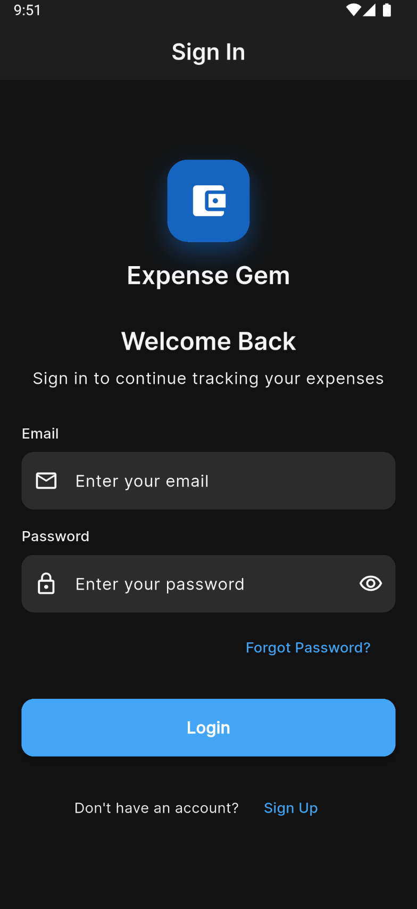
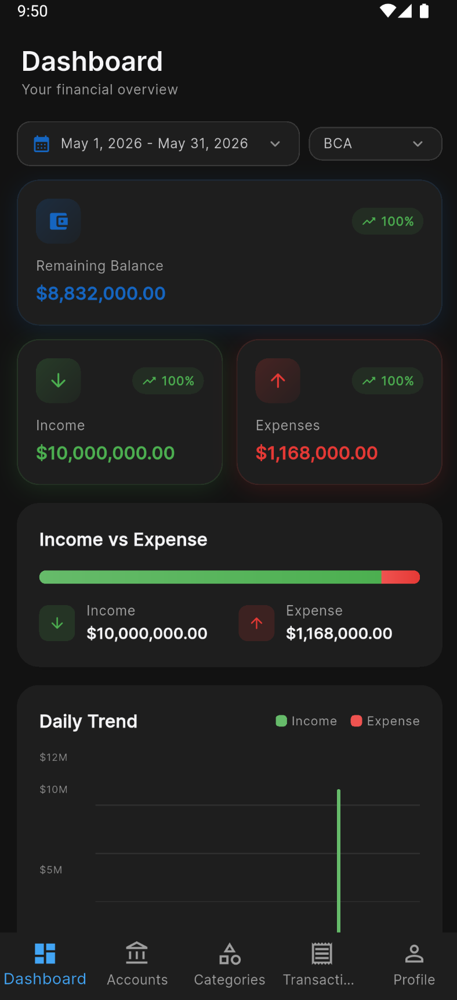

# Expense Gem Mobile

A Flutter mobile application for personal expense tracking with Clean Architecture, Riverpod state management, and Hive local storage.

## Screenshots

| Login | Dashboard |
|-------|-----------|
|  |  |

## Features

- **Authentication**: Login, Signup, Forgot Password, OTP Validation, Password Reset
- **Dashboard**: Overview of income, expenses, account balance, recent transactions, category breakdown
- **Accounts**: Manage multiple accounts (Cash, Bank, Credit Card, etc.)
- **Categories**: Create and manage transaction categories with icons and colors
- **Transactions**: Record income and expenses with categories, accounts, dates, and notes
- **Profile**: User profile management with settings

## Architecture

The app follows **Clean Architecture** with three distinct layers:

```
lib/
├── config/              # App configuration (theme, router, env)
├── core/
│   ├── entities/        # Shared entities (ResponseMessage, Pagination)
│   ├── error/           # Failures and exceptions
│   ├── services/        # Service locator (get_it)
│   └── utils/           # Utility functions
└── features/
    └── [feature_name]/
        ├── data/           # Data layer
        │   ├── datasources/ # Remote & local data sources
        │   └── repositories/ # Repository implementations
        ├── domain/          # Domain layer
        │   ├── entities/    # Business entities
        │   ├── repositories/ # Repository contracts
        │   └── usecases/    # Business logic use cases
        └── presentation/     # Presentation layer
            ├── providers/   # Riverpod providers
            ├── screens/     # UI screens
            └── widgets/     # Reusable widgets
```

### Layer Responsibilities

- **Data Layer**: Handles API calls, local storage, and data transformation
- **Domain Layer**: Contains business logic, entities, and repository interfaces
- **Presentation Layer**: Manages UI state with Riverpod and renders screens

## Navigation Flow

```
Splash (/ - initial)
    │
    ├─[Not Authenticated]──> Login (/login)
    │                              │
    │                              ├─> Signup (/signup)
    │                              │
    │                              └─> Forgot Password (/forgot-password)
    │                                           │
    │                                           └─> OTP Validation (/otp-validation)
    │                                                        │
    │                                                        └─> Reset Password (/reset-password)
    │                                                                     │
    │                                                                     └─> Reset Success (/reset-password-success)
    │
    └─[Authenticated]───────────────> Dashboard (Bottom Nav - Tab 0)
                                        │
                                        ├─> Accounts (/accounts)
                                        │       ├─> Create Account (/accounts/create)
                                        │       └─> Edit Account (/accounts/edit/:id)
                                        │
                                        ├─> Categories (/categories)
                                        │       ├─> Create Category (/categories/create)
                                        │       └─> Edit Category (/categories/edit/:id)
                                        │
                                        ├─> Transactions (/transactions)
                                        │       ├─> Create Transaction (/transactions/create)
                                        │       └─> Edit Transaction (/transactions/edit/:id)
                                        │
                                        └─> Profile (/profile)
                                                └─> Settings (/profile/settings)
```

### Bottom Navigation Tabs

1. **Dashboard** (`/dashboard`) - Overview and summary
2. **Accounts** (`/accounts`) - Account management
3. **Categories** (`/categories`) - Category management
4. **Transactions** (`/transactions`) - Transaction list
5. **Profile** (`/profile`) - User profile and settings

## Data Flow

### Authentication Flow

1. User enters credentials on Login screen
2. `LoginUseCase` validates credentials via `AuthRepository`
3. `AuthRemoteDataSource` makes API call
4. On success: tokens stored in `AuthLocalDataSource` (secure storage)
5. `AuthState` provider updates with user data
6. App navigates to Dashboard

### Transaction Flow

1. User creates/edits transaction on `TransactionFormScreen`
2. `TransactionFormNotifier` validates input
3. `CreateTransactionUseCase` or `UpdateTransactionUseCase` called
4. `TransactionRepository` attempts remote API call
5. On failure: falls back to local cache via `TransactionLocalDataSource`
6. On success: updates both remote and local storage
7. Providers invalidate to refresh UI

### Offline Support

- Transactions, Accounts, and Categories cache data locally using SharedPreferences
- When offline: app reads from local cache
- When online: syncs with remote API, then updates local cache

## State Management (Riverpod)

The app uses Riverpod with code generation:

```dart
@riverpod
class AuthState extends AutoDisposeAsyncNotifier<User?> {
  @override
  Future<User?> build() async { ... }
  
  Future<void> login(String email, String password) async { ... }
}
```

### Provider Types Used

- `AutoDisposeAsyncNotifierProvider` - For async state with cleanup
- `@riverpod` - For simple function providers
- `Provider` - For dependency injection (e.g., use cases)

## Error Handling

Failures are handled using the Failure pattern:

```dart
class ServerFailure extends Failure { ... }
class CacheFailure extends Failure { ... }
class NetworkFailure extends Failure { }
class AuthFailure extends Failure { ... }
class ValidationFailure extends Failure { ... }
```

Use `dartz` library's `Either` type for error handling:
```dart
Either<Failure, User> result = await loginUseCase.call(email, password);
```

## Dependency Injection

Uses `get_it` for service locator pattern:

```dart
getIt.registerSingleton<AuthRepository>(
  AuthRepositoryImpl(
    remoteDataSource: getIt<AuthRemoteDataSource>(),
    localDataSource: getIt<AuthLocalDataSource>(),
  ),
);
```

## Key Entities

### User
- id, firstName, lastName, email, picture

### Account
- id, name, description, icon, color, createdAt, updatedAt

### Category
- id, name, description, icon, color, createdAt, updatedAt

### Transaction
- id, amount, type (income/expense), categoryId, accountId, date, note, createdAt, updatedAt

### TransactionSummary
- remainingAmount, remainingChange
- incomeAmount, incomeChange
- expensesAmount, expensesChange
- categories (List<CategorySummary>)

## Dependencies

| Package | Purpose |
|---------|---------|
| `flutter_riverpod` | State management |
| `go_router` | Navigation |
| `dio` | HTTP client |
| `hive_flutter` | Local storage |
| `get_it` | Dependency injection |
| `dartz` | Functional programming (Either) |
| `equatable` | Value equality |
| `go_router` | Navigation |
| `fl_chart` | Charts for dashboard |
| `google_fonts` | Typography |
| `flutter_secure_storage` | Secure token storage |

## Setup

1. Install Flutter dependencies:
   ```bash
   flutter pub get
   ```

2. Configure environment variables in `.env`:
   ```
   BACKEND_URL=your_api_url
   ```

3. Run code generation (after modifying providers):
   ```bash
   flutter pub run build_runner build --delete-conflicting-outputs
   ```

4. Run the app:
   ```bash
   flutter run
   ```

## Building

```bash
# Android APK
flutter build apk

# iOS
flutter build ios

# Release mode
flutter run --release
```

## Testing

```bash
# Run all tests
flutter test

# Run specific test file
flutter test test/file_test.dart

# Run test by name
flutter test --plain-name "test name"
```

## Code Generation

After modifying Riverpod annotated classes:
```bash
flutter pub run build_runner build --delete-conflicting-outputs
```

## Analysis

```bash
# Analyze code
flutter analyze

# Auto-fix issues
flutter fix
```

## Environment Variables

Store in `.env` file:
```bash
BACKEND_URL=https://api.example.com
```

Access via `Env` class in `lib/config/env.dart`.
